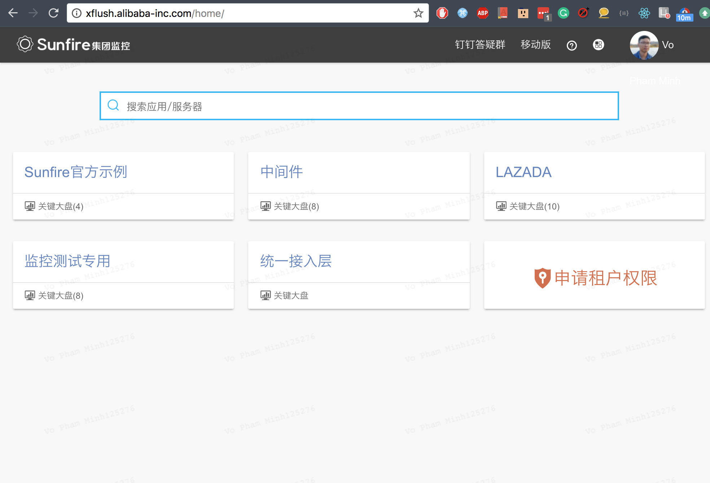
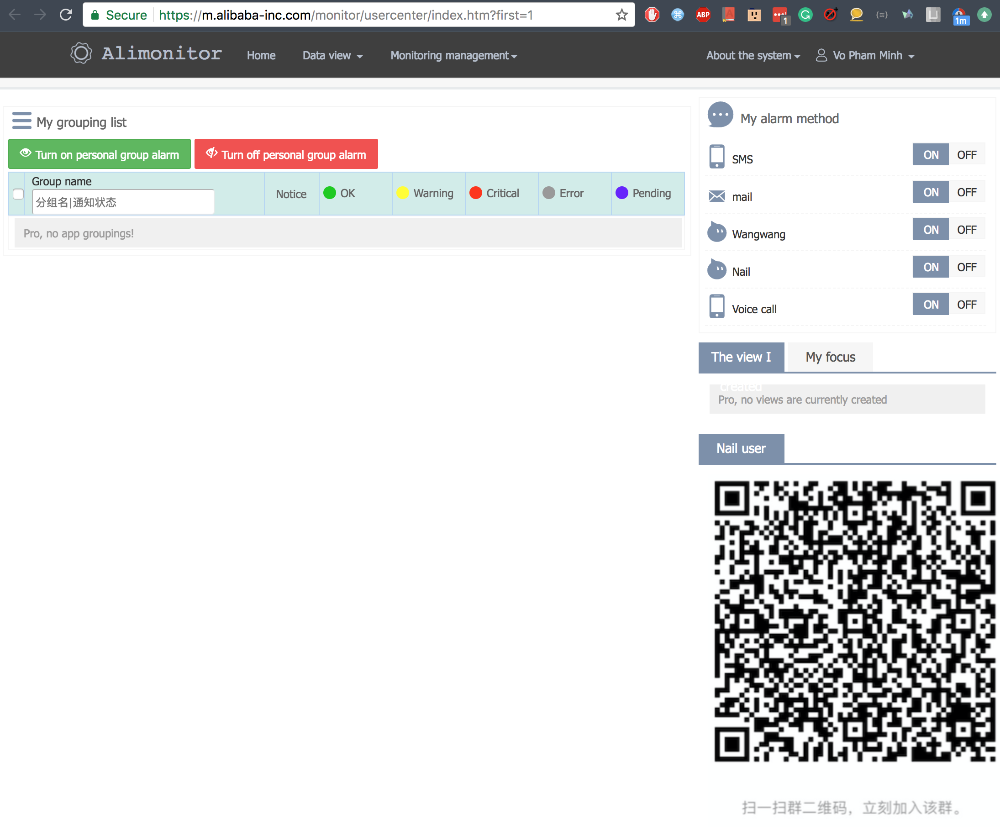
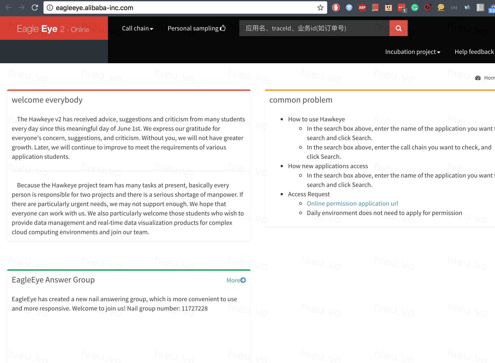
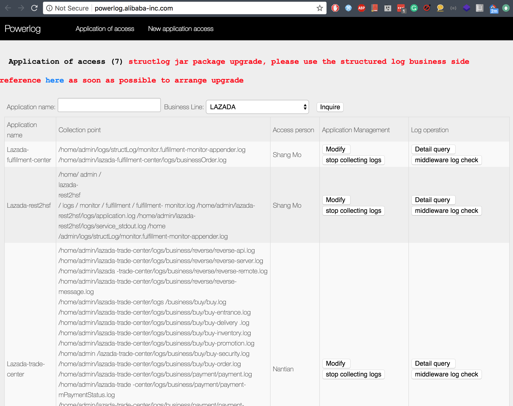

# Sunfire

- Log-based monitoring tool |
- http://x.alibaba-inc.com/ |

---

### Other systems

- Xflush |
- Alimonitor |
- Eagleeye |
- Powerlog |

---

#### Other systems - Xflush

- http://xflush.alibaba-inc.com/ |
-  |

---

#### Other systems - Alimonitor

- https://m.alibaba-inc.com/ |
-  |

---

#### Other systems - Eagleeye

- https://eagleeye.alibaba-inc.com/ |
-  |

---

#### Other systems - Powerlog

- https://powerlog.alibaba-inc.com/ |
-  |

---

### Sunfire's advantages

- Real-time monitoring |
- Flexible alarm rules |
- Custom and convenient configuration |
- Visualization |
- Low resource consumption |
- Storage |
	
---

### Demo

- How to create monitor config of order flow
- How to setup alarm rule
