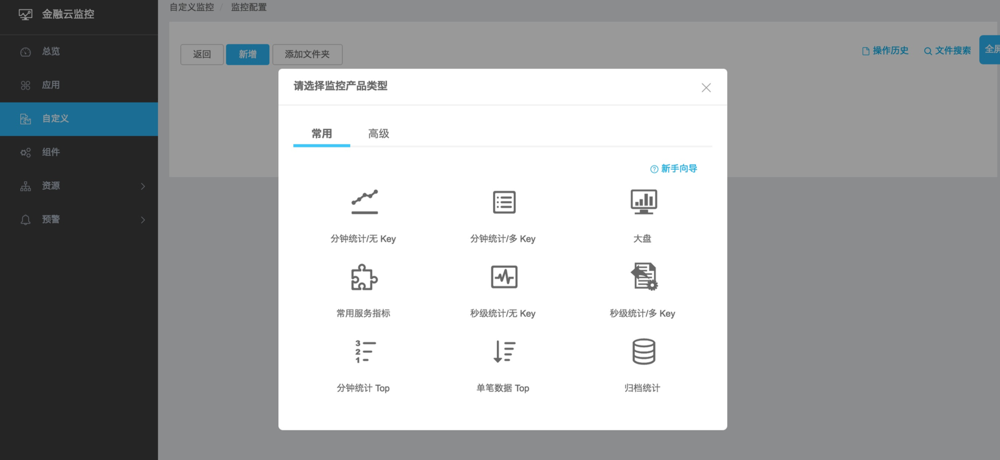

# Sunfire

- Log-based monitoring tool. Also provides other standard monitoring functions, like OS, Web, JVM, GC and middleware |
- http://x.alibaba-inc.com/ |

---

### Other systems

- Xflush (http://xflush.alibaba-inc.com/) |
- Alimonitor |
- Eagleeye (http://eagleeye.alibaba-inc.com/) |
- Powerlog (http://powerlog.alibaba-inc.com/) |

---

### Sunfire's advantages

- All-round real-time monitoring |
- Flexible alarm rules |
- Custom and convenient configuration |
- Visualization |
- Low resource consumption |
- Storage |
- Self-monitoring, self-run maintenance |
- Unitization |
	
---

### Sunfire's modules

- Overview |
- Application |
- Custom |
- Alarm |
- Plugin |
- Resource |

---

### Kinds of monitoring configuration

- Monitor at minute to second level |
- Single and multiple dimensions of metrics |

---

### Demo

- How to create checkout funnel monitoring
- How to setup alarm rule
